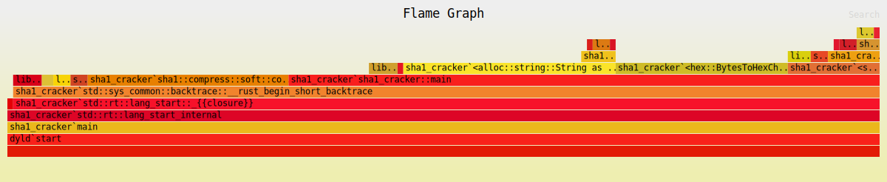

# Black Hat Rust: Chapter 1

## `clap` vs DYI

First program is a cli SHA1 cracker, my intuition would be to use `clap` for cli args, but of course you can do it with just `std::env::args()`.

## `flamegraph`

Not exactly in the materials, but because speeeeeeeed is one of the fun things about Rust. Here's a quick snippet of how to generate flamegraphs in Rust (on mac):

```shell
# cargo install not cargo add
$ cargo install flamegraph

# macOS requires sudo for dtrace
$ sudo time flamegraph -o shacracker.svg -- target/release/sha1_cracker wordlists/rockyou.txt a79d073e441db26817931eae07c5fa1091d55a5a
```



## `clippy` is your friend

In VSCode user settings JSON:

```json
{
//...
    "rust-analyzer.check.command": "clippy",
//...

}
```

## meta-thought: rabbitholes

Observe above that I am thinking that I should probably use `clap` instead of just reading the simple args as Strings. How to configure clippy, how to get perf graphs.

Those are all rabbitholes that had (almost) nothing to do with actually shipping the sha1 cracker that was the task.

The book nicely addresses this bad behavior: 

> Favor getting things done rather than the perfect design that will never ship.

Don't care if something is "suboptimal" if you do it only once. Fix on repeat.
